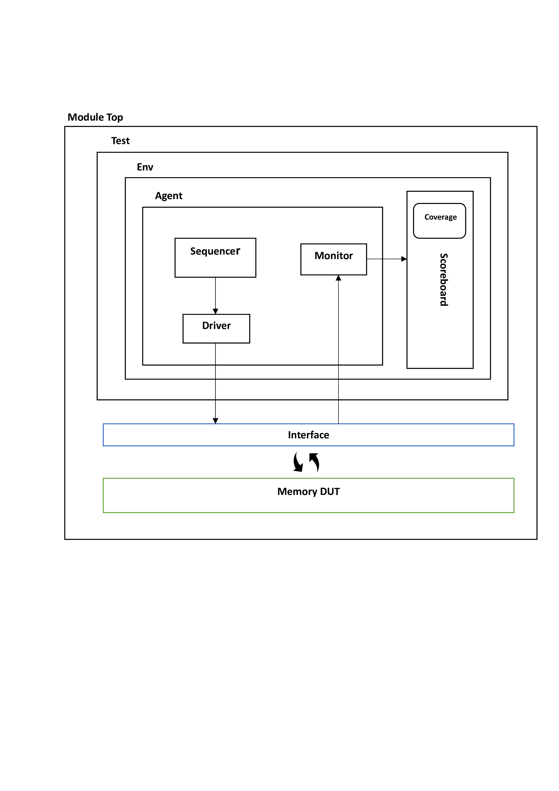
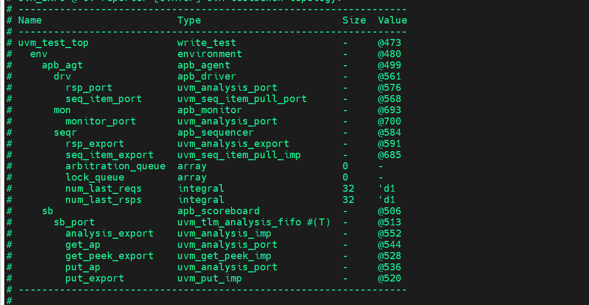
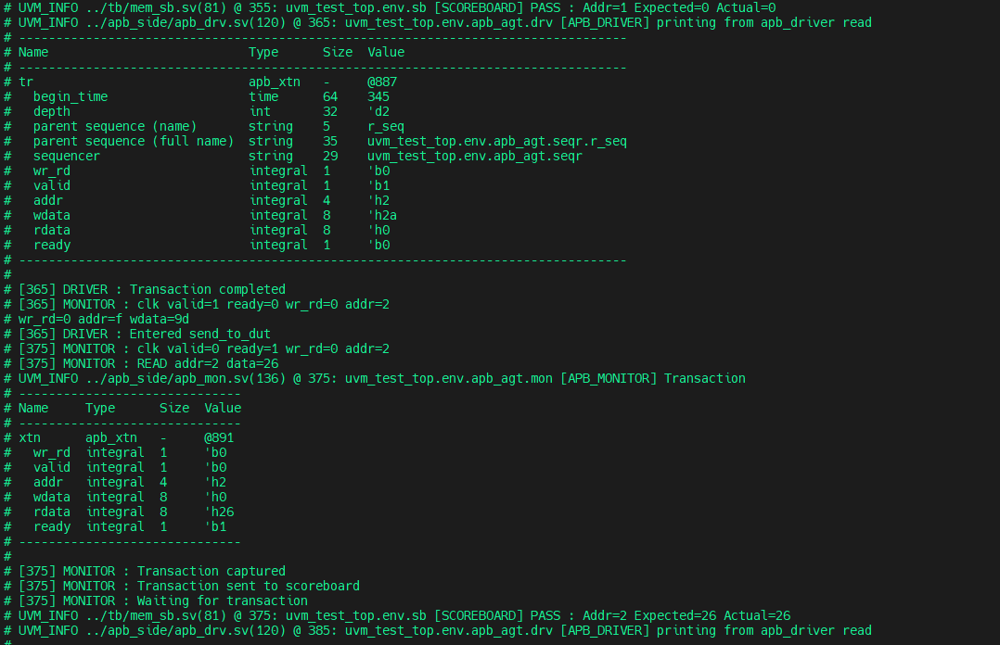
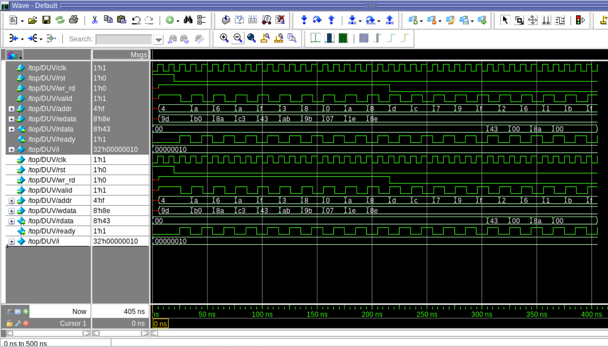
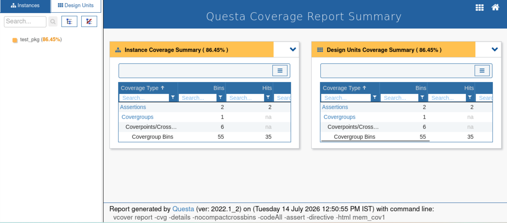

# 🧩 Functional Verification of APB-Based Memory RTL Using UVM
## 📘 Overview

This project implements a reusable **UVM (Universal Verification Methodology)** based verification environment for an **APB (Advanced Peripheral Bus) Memory RTL**. The objective is to verify memory read and write operations using constrained-random stimulus and automated checking.

The verification environment follows the standard UVM architecture and includes a **Sequencer, Driver, Monitor, Agent, Environment, Scoreboard, and Functional Coverage**. The scoreboard compares DUT transactions with a reference memory model, while functional coverage measures verification completeness.

The project was developed and simulated using **SystemVerilog, UVM 1.2, and QuestaSim**, with multiple test scenarios validating correct memory functionality and APB protocol behavior.
---
---

# 📂 Project Directory Structure

```text
Functional-Verification-of-APB-Memory-Using-UVM
│
├── rtl/
│   ├── mem_if.sv
│   └── mem_rtl.sv
│
├── apb_side/
│   ├── apb_config.sv
│   ├── apb_xtn.sv
│   ├── apb_driver.sv
│   ├── apb_monitor.sv
│   ├── apb_sequencer.sv
│   ├── apb_agent.sv
│   ├── sequence.sv
│   └── apb_pkg.sv
│
├── tb/
│   ├── env.sv
│   ├── scoreboard.sv
│   ├── test.sv
│   ├── test_pkg.sv
│   └── top.sv
│
├── sim/
│   ├── Makefile
│   └── run.do
│
├── reports/
│   ├── tb_arc
│   ├── Apb_mem_topology
│   ├── Apb_mem_output
│   ├── mem_output waveforms
│   └── mem_functional coverage reports
│
├── README.md
├── LICENSE
└── .gitignore
```

## 🧠 APB Memory Overview

The **APB (Advanced Peripheral Bus) Memory** is a simple memory module that communicates using the **Advanced Peripheral Bus (APB)** protocol. It provides an interface for storing and retrieving data through read and write transactions, making it suitable for low-speed peripheral communication in System-on-Chip (SoC) designs.

The memory performs operations based on the control signals received from the APB interface and responds with the appropriate data or status signals.

### 🔹 Basic Operations

#### ✍️ Write Operation
- Stores input data into the specified memory address.
- A write transaction is performed when the **write control signal** is asserted along with a valid address and write data.
- The data is stored in the internal memory array after a successful transaction.

#### 📖 Read Operation
- Retrieves previously stored data from the specified memory location.
- A read transaction is initiated using the target address.
- The memory returns the stored data as the read response.

### 🎯 Applications

- On-chip data storage
- Register and configuration storage
- Embedded system memory interfaces
- Peripheral data buffering
- Educational and academic APB verification projects

### ✅ Advantages

- Simple and lightweight interface
- Easy to verify using UVM methodology
- Low hardware complexity
- Low power consumption
- Suitable for low-bandwidth peripheral communication

### ⚠️ Limitations

- Supports only single data transfers (no burst transactions)
- Lower throughput compared to AHB and AXI protocols
- Not suitable for high-speed memory applications
- Performance depends on APB handshaking

---

## 🧱 UVM Testbench Architecture

The verification environment is developed using the **Universal Verification Methodology (UVM)** to provide a reusable and scalable framework for verifying the APB-based Memory RTL. The environment consists of the following components:

- **Sequencer** – Generates and controls the sequence of read and write transactions.
- **Driver** – Receives transactions from the sequencer and drives them to the Memory DUT through the virtual interface.
- **Monitor** – Observes the DUT interface, captures bus activity, and forwards the transactions for checking and coverage collection.
- **Agent** – Encapsulates the Sequencer, Driver, and Monitor into a single reusable component.
- **Environment** – Integrates the Agent and Scoreboard to build the complete verification environment.
- **Scoreboard** – Compares the DUT output with a reference memory model to verify correct read and write operations.
- **Functional Coverage** – Measures verification completeness by tracking memory addresses, data values, and transaction types exercised during simulation.

### 📌 Verification Flow

1. The **Sequencer** generates APB read and write transactions.
2. The **Driver** drives the transactions to the Memory DUT.
3. The **Monitor** captures the interface activity.
4. The **Scoreboard** compares the monitored transactions with the reference memory model.
5. **Functional Coverage** collects coverage information during simulation.
### Testbench Architecture

<p align="center">
  
</p>

## Test Cases

| Test Case | Description |
|-----------|-------------|
| Write Test | Verifies APB write operation by storing data into specified memory addresses. |
| Read Test | Verifies APB read operation by retrieving stored data from memory locations. |
| Read-Write Test | Performs write followed by read operations to validate data integrity. |

---

# 📊 Simulation Results & Functional Coverage

The verification environment was simulated using **QuestaSim**. Multiple directed and constrained-random test scenarios were executed to verify the functionality of the APB Memory RTL. The simulation results confirmed correct memory read and write operations, while the functional coverage report ensured that the intended verification scenarios were exercised.

## UVM Component Topology

<p align="center">
    
</p>

The UVM topology illustrates the hierarchy of the verification environment, showing the relationship between the **Test, Environment, Agent, Sequencer, Driver, Monitor, and Scoreboard**. This modular organization improves reusability and scalability of the verification environment.

### Simulation Output

<p align="center">
  
</p>

The simulation completed successfully, demonstrating the execution of the developed UVM testbench. The simulation log shows the generated transactions, DUT responses, and successful completion of all verification scenarios.

## Output Waveforms

<p align="center">
    
</p>

The waveform confirms the correct execution of memory read and write operations. It verifies the expected behavior of the address, data, control, and handshake signals during APB transactions.

## Functional Coverage Report

<p align="center">
    
</p>

Functional coverage was collected to measure the completeness of the verification process. The coverage results confirm that different transaction types, addresses, and memory operations were exercised during simulation, increasing confidence in the correctness of the design.

---

# 🛠️ Tools Used

| Category | Tool |
|----------|------|
| HDL | SystemVerilog |
| Verification Methodology | UVM 1.2 |
| Simulator | QuestaSim |
| Operating System | Linux (RHEL) |
| Terminal | MobaXterm |
| Version Control | Git & GitHub |

# ✅ Conclusion

This project successfully demonstrates the functional verification of an APB-based Memory RTL using a reusable UVM verification environment. The implemented testbench achieved **86% functional coverage** by validating memory read and write operations through constrained-random stimulus, automated scoreboard checking, and coverage-driven verification. The modular and reusable architecture provides a strong foundation for future enhancements, including additional test scenarios and improved functional coverage.
